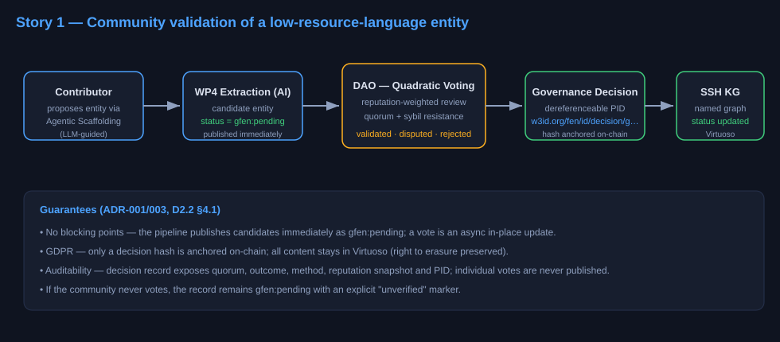
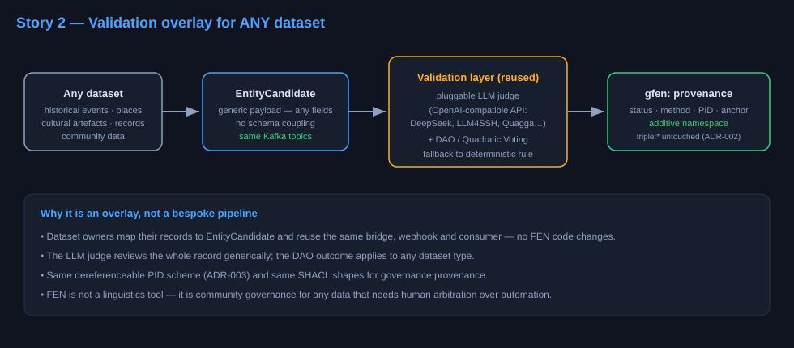

# User Stories

Two typical use cases for the FEN validation layer. The layer is deliberately
generic — it validates *any* candidate record (linguistic entities, historical
facts, place attributions, cultural artefacts), not just language data.

---

## Story 1 — Community-contributed entity (low-resource language)

**As a** community contributor from a low-resource-language community,
**I want** the entity I proposed (via Agentic Scaffolding) to be reviewed and
validated by my community through the DAO,
**so that** culturally correct terms are accepted into the SSH Knowledge Graph
instead of being published solely on the basis of automated AI extraction.

**Acceptance criteria**

- The candidate is published immediately with `gfen:pending` — the pipeline
  never blocks on a vote ("no blocking points", D2.2 §4.1).
- The community vote (Quadratic Voting) reaches quorum; the outcome is
  `validated`, `disputed`, or `rejected`.
- The annotation's `gfen:validationStatus` is updated in place in the named
  graph, and the decision gets a dereferenceable PID (ADR-003:
  `ark:{FEN_NAAN}/gNNNNN` → `https://w3id.org/fen/id/decision/gNNNNN`).
- The decision is auditable via `gfen:ledgerAnchor` (on-chain hash only —
  ADR-001; content stays in Virtuoso, GDPR right-to-erasure preserved).
- If the community never votes, the record remains `gfen:pending` in the KG
  with an explicit "unverified" marker.

**Flow mapping**

```
dap.entities.pending_validation.v1
  → FEN Bridge (outbound) → FEN API (Agentic Scaffolding + DAO/QV)
  → webhook callback → fen.governance.decisions.v1
  → Validation Result Consumer → SPARQL UPDATE (named graph)
  → dap.entities.validated.v1 → Publisher (unchanged) → Virtuoso
```



---

## Story 2 — Any-domain dataset owner (validation overlay)

**As a** dataset owner or data steward of a *non-linguistic* dataset,
**I want** to reuse the same community-validation layer as an overlay,
**so that** facts (historical events, place attributions, cultural artefacts,
community records) are community-checked before being cited — without building
a bespoke review pipeline.

**Acceptance criteria**

- The candidate payload is generic: any fields, any schema; the LLM judge and
  the DAO work on the record as-is (see the pluggable LLM judge,
  `services/common/llm.py`, and the demo in `mock_fen_api/`).
- The dataset owner only maps their records to `EntityCandidate` messages and
  reuses the same topics/webhook/consumer — no FEN code changes.
- Governance provenance is written with the additive `gfen:` namespace; no
  `triple:*` class is modified (ADR-002).
- The same dereferenceable PID scheme (ADR-003) applies to decisions about any
  dataset type.

**Flow mapping**

Same pipeline as Story 1; the only difference is the shape of the candidate
payload. This is the "validation overlay" positioning: FEN is not a
linguistics tool — it is a community-governance layer for any data that needs
human/community arbitration on top of automated extraction.


