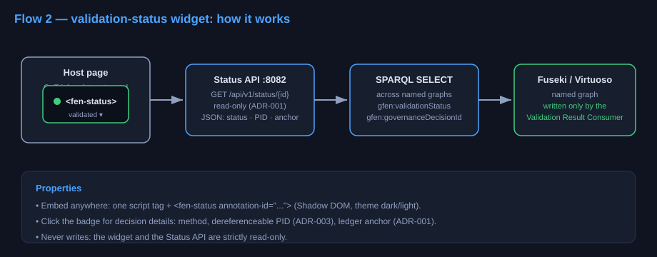

# FEN status widget (Flow 2) — embeddable validation-status badge

A zero-build Web Component that shows the community-validation status of any
entity in the SSH KG: `gfen:validationStatus` (validated / disputed /
rejected / pending / unknown), resolved **live** from the RDF store through
the Status API.

## Usage

```html
<script src="fen-status-widget.js"></script>
<fen-status annotation-id="annotation_a1" api-base="http://localhost:8082"></fen-status>
```

| Attribute | Required | Default | Description |
|---|---|---|---|
| `annotation-id` | yes | — | `oa:Annotation` id, e.g. `annotation_a1` |
| `api-base` | no | `http://localhost:8082` | Status API origin |
| `theme` | no | `dark` | `dark` or `light` |
| `live` | no | `on` | `live="off"` disables the SSE live stream (e.g. embedders whose CSP blocks `EventSource`); the widget then relies on the REST fetch + fallback polling only |

Clicking the badge expands decision details: validation method,
dereferenceable PID (`w3id.org/fen/id/decision/...`, ADR-003), reputation
snapshot and the on-chain ledger anchor (hash only, ADR-001).

> **challengeWindowEnd**: the countdown (`gfen:challengeWindowEnd`) is
> deliberately NOT rendered — ADR-006 is still a draft (ontology predicate
> "proposed, not yet applied", nothing writes it). It ships only after
> ADR-006 is accepted (BACKLOG: "Flow 2 widget: SSE real-time status +
> `gfen:challengeWindowEnd`").

## How it works



- Widget → `GET {api-base}/api/v1/status/{annotation-id}` (contract in
  [`web/api.md`](../api.md)).
- **Live updates (default on):** the widget subscribes to
  `GET {api-base}/api/v1/events/{annotation-id}` (SSE, [`web/api.md`](../api.md) §4b).
  `event: status` carries the same payload as the REST endpoint and renders
  through the same path — records that do not exist yet appear as soon as
  the pipeline validates them. While the stream is down (EventSource
  auto-reconnects) a 15s polling fallback keeps the badge fresh, so no
  status flip is lost.
- The Status API executes a SPARQL SELECT over the named graphs (Fuseki
  locally, Virtuoso in production) — the widget never talks to Kafka or the
  graph directly and never writes anything.
- CORS is enabled on the Status API so the widget can be embedded in
  third-party pages (GoTriple, dataset portals).

## Run locally

```bash
docker compose up --build status-api    # serves /web/demo.html at :8082
# or open web/widget/demo.html directly (widget fetches :8082)
```
